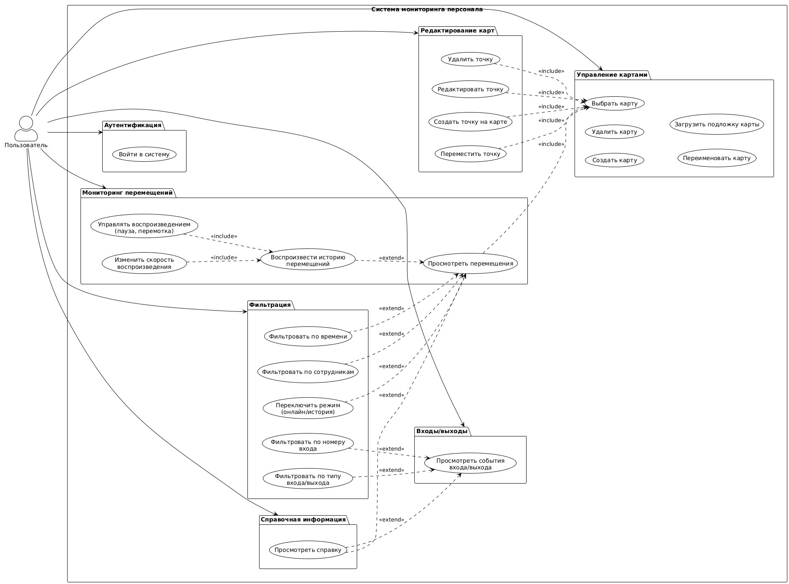

# Система мониторинга персонала (Staff Control)

## Лабораторная работа №1: Формулирование требований к программной системе

---

## 1. Перечень заинтересованных лиц (стейкхолдеров)

### 1.1. Начальник ИТ компании
**Описание:** Руководитель ИТ-подразделения компании-разработчика, ответственный за разработку и продажу программного обеспечения производственным предприятиям.

**Интересы:**
- Успешная продажа системы мониторинга персонала производственным предприятиям
- Демонстрация функциональности и преимуществ системы потенциальным клиентам
- Обеспечение качества продукта для повышения конкурентоспособности
- Развитие функциональности системы на основе обратной связи от клиентов
- Обеспечение технической поддержки и сопровождения системы

### 1.2. Начальник с производства
**Описание:** Руководитель производственного подразделения, ответственный за контроль рабочего процесса и дисциплины сотрудников.

**Интересы:**
- Мониторинг перемещений сотрудников в реальном времени
- Анализ истории перемещений для оптимизации производственных процессов
- Контроль соблюдения рабочего времени
- Получение отчетов о перемещениях персонала
- Управление картами помещений и точками контроля

---

## 2. Перечень функциональных требований

### 2.1. Аутентификация и авторизация
- **ФТ-1:** Система должна предоставлять возможность входа пользователя по логину и паролю
- **ФТ-2:** Система должна проверять права доступа пользователя перед предоставлением доступа к функциональности

### 2.2. Управление картами помещений
- **ФТ-3:** Система должна предоставлять возможность создания новой карты помещения
- **ФТ-4:** Система должна предоставлять возможность удаления существующей карты
- **ФТ-5:** Система должна предоставлять возможность переименования карты
- **ФТ-6:** Система должна предоставлять возможность загрузки SVG-подложки для карты
- **ФТ-7:** Система должна отображать список доступных карт для выбора

### 2.3. Управление точками на карте
- **ФТ-8:** Система должна предоставлять возможность создания точек на карте (сенсоры, оборудование)
- **ФТ-9:** Система должна предоставлять возможность редактирования параметров точки (название, MAC-адрес, координаты)
- **ФТ-10:** Система должна предоставлять возможность удаления точки с карты
- **ФТ-11:** Система должна предоставлять возможность перемещения точки на карте путем перетаскивания
- **ФТ-12:** Система должна отображать точки с различными типами: сенсор (sensor), оборудование (machine), сотрудник (person)
- **ФТ-13:** Система должна отображать статус точки: создана (created), подключена (connected), работает (working), ошибка (error)

### 2.4. Мониторинг перемещений сотрудников
- **ФТ-14:** Система должна отображать текущее местоположение сотрудников на карте в режиме реального времени через WebSocket
- **ФТ-15:** Система должна отображать историю перемещений сотрудников за выбранный период времени
- **ФТ-16:** Система должна предоставлять возможность воспроизведения истории перемещений с помощью плеера
- **ФТ-17:** Система должна предоставлять возможность управления воспроизведением (пауза, перемотка вперед/назад)
- **ФТ-18:** Система должна предоставлять возможность изменения скорости воспроизведения (×1, ×2, ×4, ×8)
- **ФТ-19:** Система должна отображать область неопределенности местоположения (диаметр позиции) для каждой точки

### 2.5. Фильтрация данных для мониторинга перемещений
- **ФТ-20:** Система должна предоставлять возможность фильтрации по выбранным сотрудникам
- **ФТ-21:** Система должна предоставлять возможность фильтрации по временному периоду (начальная и конечная дата/время)
- **ФТ-22:** Система должна предоставлять возможность переключения между режимом реального времени (онлайн) и историческим режимом
- **ФТ-23:** Система должна применять выбранные фильтры к отображаемым данным

### 2.6. Отслеживание входов/выходов
- **ФТ-24:** Система должна отображать список событий входа/выхода сотрудников
- **ФТ-25:** Система должна предоставлять возможность фильтрации событий по типу (вход/выход)
- **ФТ-26:** Система должна предоставлять возможность фильтрации событий по номеру входа
- **ФТ-27:** Система должна предоставлять возможность фильтрации событий по временному периоду
- **ФТ-28:** Система должна отображать для каждого события: ФИО сотрудника, время события, номер входа, тип события

### 2.7. Навигация и интерфейс
- **ФТ-29:** Система должна предоставлять навигационную панель для перехода между разделами
- **ФТ-30:** Система должна предоставлять окно помощи с инструкциями по использованию системы
- **ФТ-31:** Система должна отображать текущую выбранную карту

---

## 3. Диаграмма вариантов использования



```
@startuml
!theme plain
skinparam actorStyle awesome
skinparam usecaseStyle rectangle

left to right direction

actor "Пользователь" as User

rectangle "Система мониторинга персонала" {
    package "Аутентификация" as Auth {
        usecase "Войти в систему" as UC_Login
    }
    
    package "Управление картами" as Map {
        usecase "Создать карту" as UC_CreateMap
        usecase "Удалить карту" as UC_DeleteMap
        usecase "Переименовать карту" as UC_RenameMap
        usecase "Загрузить подложку карты" as UC_UploadMapBackground
        usecase "Выбрать карту" as UC_SelectMap
    }
    
    package "Редактирование карт" as Canvas {
        usecase "Создать точку на карте" as UC_CreatePoint
        usecase "Редактировать точку" as UC_EditPoint
        usecase "Удалить точку" as UC_DeletePoint
        usecase "Переместить точку" as UC_MovePoint
    }
    
    package "Мониторинг перемещений" as Monitoring {
        usecase "Просмотреть перемещения" as UC_ViewMovements
        usecase "Воспроизвести историю\nперемещений" as UC_PlaybackHistory
        usecase "Управлять воспроизведением\n(пауза, перемотка)" as UC_ControlPlayback
        usecase "Изменить скорость\nвоспроизведения" as UC_ChangePlaybackSpeed
    }
    
    package "Фильтрация" as Filters {
        usecase "Фильтровать по сотрудникам" as UC_FilterByEmployees
        usecase "Фильтровать по времени" as UC_FilterByTime
        usecase "Переключить режим\n(онлайн/история)" as UC_ToggleMode
        usecase "Фильтровать по типу\nвхода/выхода" as UC_FilterByEntranceType
        usecase "Фильтровать по номеру\nвхода" as UC_FilterByEntranceNumber
    }
    
    package "Входы/выходы" as Entrance {
        usecase "Просмотреть события\nвхода/выхода" as UC_ViewEntranceEvents
    }
    
    package "Справочная информация" as Help {
        usecase "Просмотреть справку" as UC_ViewHelp
    }
}

' Связи пользователя с пакетами
User -- Auth
User -- Map
User -- Canvas
User -- Monitoring
User -- Filters
User -- Entrance
User -- Help

' Зависимости между вариантами использования
' Воспроизведение истории всегда включает управление и изменение скорости
UC_ControlPlayback ..> UC_PlaybackHistory : <<include>>
UC_ChangePlaybackSpeed ..> UC_PlaybackHistory : <<include>>

' Воспроизведение истории опционально расширяет просмотр перемещений
UC_PlaybackHistory ..> UC_ViewMovements : <<extend>>

' Просмотр перемещений всегда требует выбора карты
UC_ViewMovements ..> UC_SelectMap : <<include>>

' Фильтры опционально расширяют просмотр перемещений
UC_FilterByEmployees ..> UC_ViewMovements : <<extend>>
UC_FilterByTime ..> UC_ViewMovements : <<extend>>
UC_ToggleMode ..> UC_ViewMovements : <<extend>>

' Редактирование точек всегда требует выбора карты
UC_CreatePoint ..> UC_SelectMap : <<include>>
UC_EditPoint ..> UC_SelectMap : <<include>>
UC_DeletePoint ..> UC_SelectMap : <<include>>
UC_MovePoint ..> UC_SelectMap : <<include>>

' Фильтры опционально расширяют просмотр событий входа/выхода
UC_FilterByEntranceType ..> UC_ViewEntranceEvents : <<extend>>
UC_FilterByEntranceNumber ..> UC_ViewEntranceEvents : <<extend>>

' Справка опционально доступна из разных разделов
UC_ViewHelp ..> UC_ViewMovements : <<extend>>
UC_ViewHelp ..> UC_ViewEntranceEvents : <<extend>>

@enduml
```

---

## 4. Перечень сделанных предположений

### 4.1. Технические предположения
- **П-1:** Система работает в веб-браузере и использует современные технологии (Angular, WebSocket)
- **П-2:** Серверная часть системы уже реализована и предоставляет REST API и WebSocket соединение
- **П-3:** Данные о местоположении сотрудников получаются от внешней системы отслеживания (например, по MAC-адресам устройств)
- **П-4:** Система поддерживает работу с несколькими картами помещений одновременно
- **П-5:** Координаты точек на карте нормализованы (значения от 0 до 1) для независимости от размера карты

### 4.2. Функциональные предположения
- **П-6:** Пользователь имеет права администратора и может управлять картами и точками
- **П-7:** Система автоматически определяет местоположение сотрудников на основе данных от сенсоров
- **П-8:** Исторические данные о перемещениях хранятся на сервере и доступны для запросов
- **П-9:** Система поддерживает работу в режиме реального времени с задержкой не более нескольких секунд
- **П-10:** Сотрудники не имеют прямого доступа к системе, их местоположение отслеживается автоматически

### 4.3. Предположения о данных
- **П-11:** Каждый сотрудник имеет уникальный идентификатор и привязан к устройству с MAC-адресом
- **П-12:** Сенсоры и оборудование имеют статическое местоположение на карте
- **П-13:** Система хранит историю перемещений с определенной периодичностью (например, каждые N секунд)
- **П-14:** Данные о входах/выходах фиксируются автоматически при прохождении сотрудника через контрольную точку

### 4.4. Предположения о безопасности
- **П-15:** Доступ к системе защищен системой аутентификации
- **П-16:** Данные передаются по защищенному соединению (HTTPS/WSS)
- **П-17:** Персональные данные сотрудников обрабатываются в соответствии с требованиями защиты данных

### 4.5. Предположения о пользовательском интерфейсе
- **П-18:** Интерфейс системы поддерживает русский язык
- **П-19:** Система адаптивна и может работать на различных разрешениях экрана

---

## 5. Перечень нефункциональных требований

### 5.1. Производительность
- **НФТ-1:** Система должна обрабатывать запросы на получение данных о местоположении сотрудников с задержкой не более 2 секунд
- **НФТ-2:** Система должна поддерживать одновременный мониторинг не менее 100 сотрудников без деградации производительности
- **НФТ-3:** Система должна обновлять данные о местоположении в режиме реального времени с частотой не реже 1 раза в 5 секунд
- **НФТ-4:** Система должна загружать карту с подложкой и точками за время не более 3 секунд

### 5.2. Масштабируемость
- **НФТ-5:** Система должна быть способна обрабатывать данные с нескольких карт одновременно
- **НФТ-6:** Архитектура системы должна позволять горизонтальное масштабирование при увеличении нагрузки
- **НФТ-7:** Система должна эффективно работать с историческими данными за период до 1 года

### 5.3. Надежность
- **НФТ-8:** Система должна обеспечивать доступность не менее 99% времени (uptime)
- **НФТ-9:** Система должна корректно обрабатывать потерю WebSocket соединения и автоматически восстанавливать его
- **НФТ-10:** Система должна обрабатывать ошибки сервера без полного падения интерфейса пользователя

### 5.4. Безопасность
- **НФТ-11:** Система должна использовать HTTPS для всех HTTP запросов
- **НФТ-12:** Система должна использовать WSS (WebSocket Secure) для WebSocket соединений
- **НФТ-13:** Токены аутентификации должны храниться безопасно (localStorage с защитой от XSS)
- **НФТ-14:** Система должна проверять права доступа на сервере для всех операций
- **НФТ-15:** Система должна защищать персональные данные сотрудников в соответствии с требованиями защиты данных

### 5.5. Удобство использования (Usability)
- **НФТ-16:** Система должна предоставлять контекстную справку и подсказки
- **НФТ-17:** Система должна отображать понятные сообщения об ошибках на русском языке
- **НФТ-18:** Система должна обеспечивать быструю навигацию между разделами (не более 2 кликов)

### 5.6. Совместимость
- **НФТ-19:** Система должна работать в современных браузерах (Chrome, Firefox, Edge последних версий)
- **НФТ-20:** Система должна корректно отображаться на разрешениях экрана от 1280×720 и выше
- **НФТ-21:** Система должна поддерживать работу с SVG картами различных размеров

### 5.7. Поддерживаемость
- **НФТ-22:** Код системы должен быть структурирован и документирован для облегчения поддержки
- **НФТ-23:** Система должна использовать современные технологии и паттерны разработки
- **НФТ-24:** Система должна логировать критические ошибки для диагностики проблем

---

