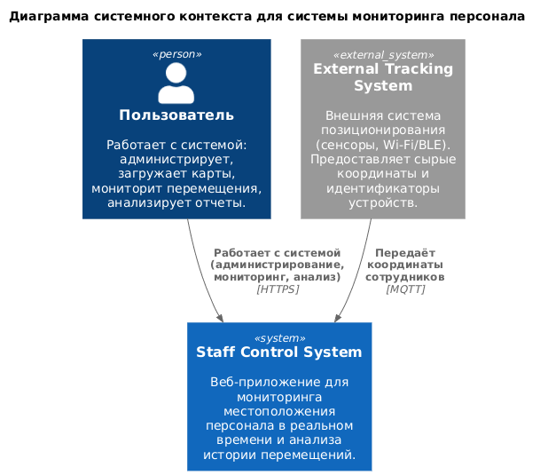
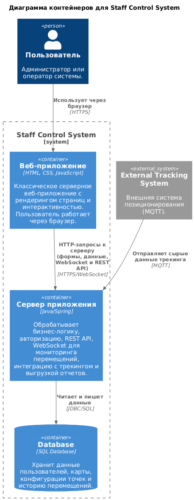
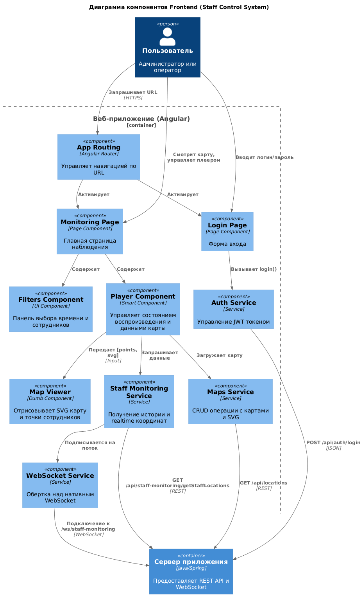
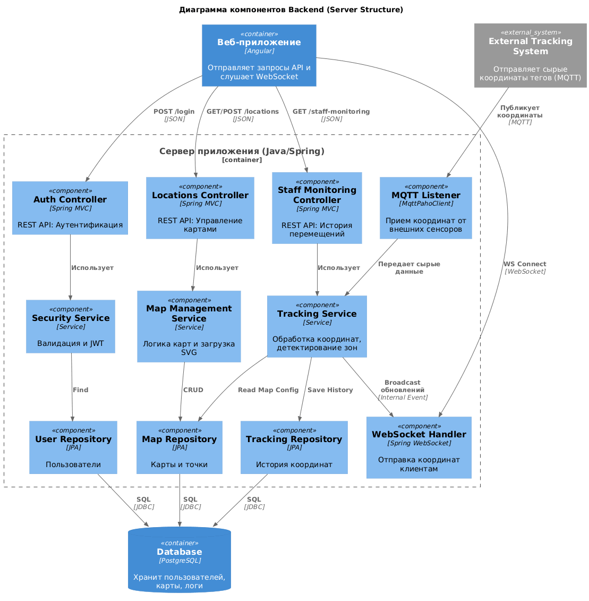

# Диаграмма системного контекста



```
@startuml
!include https://raw.githubusercontent.com/plantuml-stdlib/C4-PlantUML/master/C4_Context.puml

title Диаграмма системного контекста для системы мониторинга персонала

' Пользователь
Person(user, "Пользователь", "Работает с системой: администрирует, загружает карты, мониторит перемещения, анализирует отчеты.")

' Система
System(staff_system, "Staff Control System", "Веб-приложение для мониторинга местоположения персонала в реальном времени и анализа истории перемещений.")

' Внешние системы
System_Ext(tracking_system, "External Tracking System", "Внешняя система позиционирования (сенсоры, Wi-Fi/BLE). Предоставляет сырые координаты и идентификаторы устройств.")

' Связи
Rel(user, staff_system, "Работает с системой (администрирование, мониторинг, анализ)", "HTTPS")
Rel(tracking_system, staff_system, "Передаёт координаты сотрудников", "MQTT")

@enduml
```

# Диаграмма контейнеров с пояснениями по выбору базового архитектурного стиля / архитектуры уровня приложений



```
@startuml
!include https://raw.githubusercontent.com/plantuml-stdlib/C4-PlantUML/master/C4_Component.puml

title Диаграмма компонентов Frontend (Staff Control System)

' 1. ВНЕШНИЕ ЭЛЕМЕНТЫ (Контекст)
Person(user, "Пользователь", "Администратор или оператор")
Container(backend, "Сервер приложения", "Java/Spring", "Предоставляет REST API и WebSocket")

' 2. РАСКРЫТЫЙ КОНТЕЙНЕР (Frontend)
Container_Boundary(frontend, "Веб-приложение (Angular)") {
    
    Component(router, "App Routing", "Angular Router", "Управляет навигацией по URL")

    ' Основные страницы (Pages)
    Component(loginPage, "Login Page", "Page Component", "Форма входа")
    Component(monitoringPage, "Monitoring Page", "Page Component", "Главная страница наблюдения")

    ' Умные компоненты (Smart Components)
    Component(player, "Player Component", "Smart Component", "Управляет состоянием воспроизведения и данными карты")
    Component(filters, "Filters Component", "UI Component", "Панель выбора времени и сотрудников")

    ' Презентационные компоненты (Dumb Components)
    Component(mapViewer, "Map Viewer", "Dumb Component", "Отрисовывает SVG карту и точки сотрудников")

    ' Сервисы (Services) - Слой доступа к данным
    Component(authService, "Auth Service", "Service", "Управление JWT токеном")
    Component(monitoringService, "Staff Monitoring Service", "Service", "Получение истории и realtime координат")
    Component(mapsService, "Maps Service", "Service", "CRUD операции с картами и SVG")
    Component(wsService, "WebSocket Service", "Service", "Обертка над нативным WebSocket")
    
    ' --- ВНУТРЕННИЕ СВЯЗИ ---
    
    ' Навигация
    Rel(user, router, "Запрашивает URL", "HTTPS")
    Rel(router, loginPage, "Активирует")
    Rel(router, monitoringPage, "Активирует")

    ' Взаимодействие на странице
    Rel(user, loginPage, "Вводит логин/пароль")
    Rel(user, monitoringPage, "Смотрит карту, управляет плеером")
    
    ' Связи компонентов
    Rel(monitoringPage, player, "Содержит")
    Rel(monitoringPage, filters, "Содержит")
    Rel(player, mapViewer, "Передает [points, svg]", "Input")
    
    ' Связи с сервисами (Логика)
    Rel(loginPage, authService, "Вызывает login()")
    Rel(player, monitoringService, "Запрашивает данные")
    Rel(player, mapsService, "Загружает карту")
    Rel(monitoringService, wsService, "Подписывается на поток")
    
    ' --- ИСХОДЯЩИЕ ЗАПРОСЫ (К Бэкенду) ---
    Rel(authService, backend, "POST /api/auth/login", "JSON")
    Rel(mapsService, backend, "GET /api/locations", "REST")
    Rel(monitoringService, backend, "GET /api/staff-monitoring/getStaffLocations", "REST")
    Rel(wsService, backend, "Подключение к /ws/staff-monitoring", "WebSocket")
}

@enduml
```

Диаграмма компонентов для frontend 



```
@startuml
!include https://raw.githubusercontent.com/plantuml-stdlib/C4-PlantUML/master/C4_Component.puml

title Диаграмма компонентов Frontend (Staff Control System)

' 1. ВНЕШНИЕ ЭЛЕМЕНТЫ (Контекст)
Person(user, "Пользователь", "Администратор или оператор")
Container(backend, "Сервер приложения", "Java/Spring", "Предоставляет REST API и WebSocket")

' 2. РАСКРЫТЫЙ КОНТЕЙНЕР (Frontend)
Container_Boundary(frontend, "Веб-приложение (Angular)") {
    
    Component(router, "App Routing", "Angular Router", "Управляет навигацией по URL")

    ' Основные страницы (Pages)
    Component(loginPage, "Login Page", "Page Component", "Форма входа")
    Component(monitoringPage, "Monitoring Page", "Page Component", "Главная страница наблюдения")

    ' Умные компоненты (Smart Components)
    Component(player, "Player Component", "Smart Component", "Управляет состоянием воспроизведения и данными карты")
    Component(filters, "Filters Component", "UI Component", "Панель выбора времени и сотрудников")

    ' Презентационные компоненты (Dumb Components)
    Component(mapViewer, "Map Viewer", "Dumb Component", "Отрисовывает SVG карту и точки сотрудников")

    ' Сервисы (Services) - Слой доступа к данным
    Component(authService, "Auth Service", "Service", "Управление JWT токеном")
    Component(monitoringService, "Staff Monitoring Service", "Service", "Получение истории и realtime координат")
    Component(mapsService, "Maps Service", "Service", "CRUD операции с картами и SVG")
    Component(wsService, "WebSocket Service", "Service", "Обертка над нативным WebSocket")
    
    ' --- ВНУТРЕННИЕ СВЯЗИ ---
    
    ' Навигация
    Rel(user, router, "Запрашивает URL", "HTTPS")
    Rel(router, loginPage, "Активирует")
    Rel(router, monitoringPage, "Активирует")

    ' Взаимодействие на странице
    Rel(user, loginPage, "Вводит логин/пароль")
    Rel(user, monitoringPage, "Смотрит карту, управляет плеером")
    
    ' Связи компонентов
    Rel(monitoringPage, player, "Содержит")
    Rel(monitoringPage, filters, "Содержит")
    Rel(player, mapViewer, "Передает [points, svg]", "Input")
    
    ' Связи с сервисами (Логика)
    Rel(loginPage, authService, "Вызывает login()")
    Rel(player, monitoringService, "Запрашивает данные")
    Rel(player, mapsService, "Загружает карту")
    Rel(monitoringService, wsService, "Подписывается на поток")
    
    ' --- ИСХОДЯЩИЕ ЗАПРОСЫ (К Бэкенду) ---
    Rel(authService, backend, "POST /api/auth/login", "JSON")
    Rel(mapsService, backend, "GET /api/locations", "REST")
    Rel(monitoringService, backend, "GET /api/staff-monitoring/getStaffLocations", "REST")
    Rel(wsService, backend, "Подключение к /ws/staff-monitoring", "WebSocket")
}

@enduml
```

# Диаграмма компонентов для backend



```
@startuml
!include https://raw.githubusercontent.com/plantuml-stdlib/C4-PlantUML/master/C4_Component.puml

title Диаграмма компонентов Backend (Server Structure)

' 1. ВНЕШНИЕ СИСТЕМЫ (Контекст)
Container(webapp, "Веб-приложение", "Angular", "Отправляет запросы API и слушает WebSocket")
ContainerDb(db, "Database", "PostgreSQL", "Хранит пользователей, карты, логи")
System_Ext(mqtt_source, "External Tracking System", "Отправляет сырые координаты тегов (MQTT)")

' 2. РАСКРЫТЫЙ КОНТЕЙНЕР (Backend)
Container_Boundary(backend_boundary, "Сервер приложения (Java/Spring)") {
    
    ' API Controllers (Входные точки HTTP)
    Component(authController, "Auth Controller", "Spring MVC", "REST API: Аутентификация")
    Component(locController, "Locations Controller", "Spring MVC", "REST API: Управление картами")
    Component(staffController, "Staff Monitoring Controller", "Spring MVC", "REST API: История перемещений")
    
    ' Messaging Handlers (Входные точки Real-time)
    Component(wsHandler, "WebSocket Handler", "Spring WebSocket", "Отправка координат клиентам")
    Component(mqttListener, "MQTT Listener", "MqttPahoClient", "Прием координат от внешних сенсоров")

    ' Service Layer (Бизнес-логика)
    Component(securityService, "Security Service", "Service", "Валидация и JWT")
    Component(mapService, "Map Management Service", "Service", "Логика карт и загрузка SVG")
    Component(trackingService, "Tracking Service", "Service", "Обработка координат, детектирование зон")
    
    ' Data Access Layer (Работа с БД)
    Component(userRepo, "User Repository", "JPA", "Пользователи")
    Component(mapRepo, "Map Repository", "JPA", "Карты и точки")
    Component(logRepo, "Tracking Repository", "JPA", "История координат")

    ' --- ВХОДЯЩИЕ ПОТОКИ (ПРЯМЫЕ СВЯЗИ) ---
    
    ' От Веб-приложения -> Напрямую в Контроллеры
    Rel(webapp, authController, "POST /login", "JSON")
    Rel(webapp, locController, "GET/POST /locations", "JSON")
    Rel(webapp, staffController, "GET /staff-monitoring", "JSON")
    Rel(webapp, wsHandler, "WS Connect", "WebSocket")
    
    ' От MQTT -> Напрямую в Листенер
    Rel(mqtt_source, mqttListener, "Публикует координаты", "MQTT")

    ' --- ВНУТРЕННЯЯ ЛОГИКА ---
    ' Контроллеры -> Сервисы
    Rel(authController, securityService, "Использует")
    Rel(locController, mapService, "Использует")
    Rel(staffController, trackingService, "Использует")
    
    ' Real-time потоки
    Rel(mqttListener, trackingService, "Передает сырые данные")
    Rel(trackingService, wsHandler, "Broadcast обновлений", "Internal Event")

    ' Сервисы -> Репозитории
    Rel(securityService, userRepo, "Find")
    Rel(mapService, mapRepo, "CRUD")
    Rel(trackingService, logRepo, "Save History")
    Rel(trackingService, mapRepo, "Read Map Config")

    ' --- ИСХОДЯЩИЕ В БД ---
    Rel(userRepo, db, "SQL", "JDBC")
    Rel(mapRepo, db, "SQL", "JDBC")
    Rel(logRepo, db, "SQL", "JDBC")
}

@enduml
```