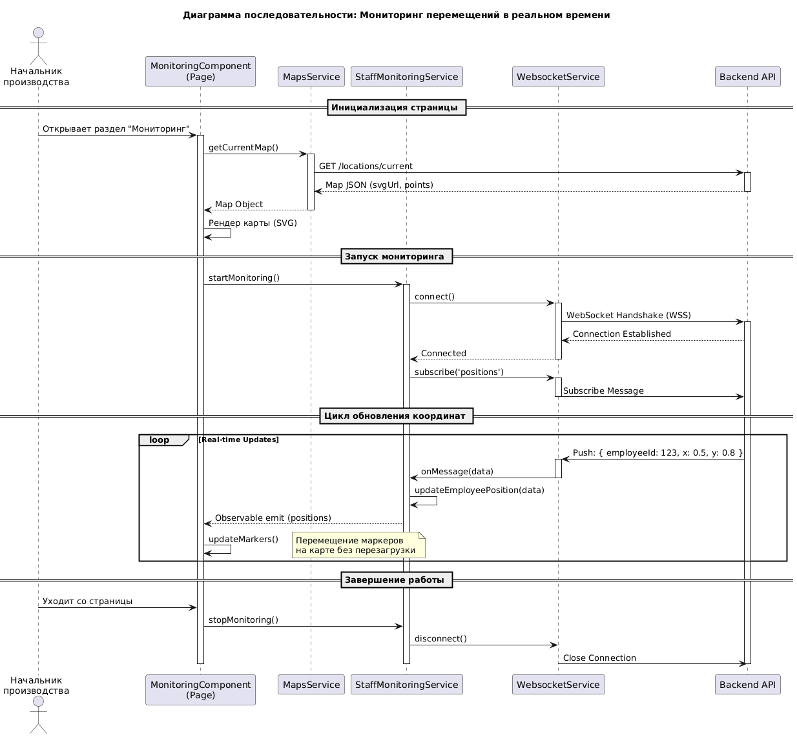
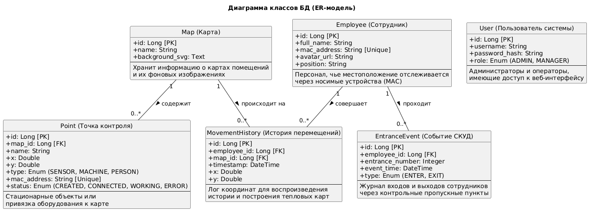

# Диаграмма последовательности: Мониторинг перемещений в реальном времени



```
@startuml
title Диаграмма последовательности: Мониторинг перемещений в реальном времени

actor "Начальник\nпроизводства" as User
participant "MonitoringComponent\n(Page)" as Page
participant "MapsService" as MapSvc
participant "StaffMonitoringService" as MonitorSvc
participant "WebsocketService" as WsSvc
participant "Backend API" as API

== Инициализация страницы ==

User -> Page: Открывает раздел "Мониторинг"
activate Page

Page -> MapSvc: getCurrentMap()
activate MapSvc
MapSvc -> API: GET /locations/current
activate API
API --> MapSvc: Map JSON (svgUrl, points)
deactivate API
MapSvc --> Page: Map Object
deactivate MapSvc

Page -> Page: Рендер карты (SVG)

== Запуск мониторинга ==

Page -> MonitorSvc: startMonitoring()
activate MonitorSvc

MonitorSvc -> WsSvc: connect()
activate WsSvc
WsSvc -> API: WebSocket Handshake (WSS)
activate API
API --> WsSvc: Connection Established
WsSvc --> MonitorSvc: Connected
deactivate WsSvc

MonitorSvc -> WsSvc: subscribe('positions')
activate WsSvc
WsSvc -> API: Subscribe Message
deactivate WsSvc

== Цикл обновления координат ==

loop Real-time Updates
    API -> WsSvc: Push: { employeeId: 123, x: 0.5, y: 0.8 }
    activate WsSvc
    WsSvc -> MonitorSvc: onMessage(data)
    deactivate WsSvc
    
    MonitorSvc -> MonitorSvc: updateEmployeePosition(data)
    MonitorSvc --> Page: Observable emit (positions)
    
    Page -> Page: updateMarkers()
    note right: Перемещение маркеров\nна карте без перезагрузки
end

== Завершение работы ==

User -> Page: Уходит со страницы
Page -> MonitorSvc: stopMonitoring()
MonitorSvc -> WsSvc: disconnect()
WsSvc -> API: Close Connection
deactivate API
deactivate MonitorSvc
deactivate Page

@enduml
```

# Модель БД



```
@startuml
title Диаграмма классов БД (ER-модель)

hide circle
skinparam classAttributeIconSize 0

' Сущности

class "Map (Карта)" as Map {
  +id: Long [PK]
  +name: String
  +background_svg: Text
  --
  Хранит информацию о картах помещений
  и их фоновых изображениях
}

class "Point (Точка контроля)" as Point {
  +id: Long [PK]
  +map_id: Long [FK]
  +name: String
  +x: Double
  +y: Double
  +type: Enum (SENSOR, MACHINE, PERSON)
  +mac_address: String [Unique]
  +status: Enum (CREATED, CONNECTED, WORKING, ERROR)
  --
  Стационарные объекты или 
  привязка оборудования к карте
}

class "Employee (Сотрудник)" as Employee {
  +id: Long [PK]
  +full_name: String
  +mac_address: String [Unique]
  +avatar_url: String
  +position: String
  --
  Персонал, чье местоположение отслеживается
  через носимые устройства (MAC)
}

class "MovementHistory (История перемещений)" as Movement {
  +id: Long [PK]
  +employee_id: Long [FK]
  +map_id: Long [FK]
  +timestamp: DateTime
  +x: Double
  +y: Double
  --
  Лог координат для воспроизведения
  истории и построения тепловых карт
}

class "EntranceEvent (Событие СКУД)" as Entrance {
  +id: Long [PK]
  +employee_id: Long [FK]
  +entrance_number: Integer
  +event_time: DateTime
  +type: Enum (ENTER, EXIT)
  --
  Журнал входов и выходов сотрудников
  через контрольные пропускные пункты
}

class "User (Пользователь системы)" as User {
  +id: Long [PK]
  +username: String
  +password_hash: String
  +role: Enum (ADMIN, MANAGER)
  --
  Администраторы и операторы, 
  имеющие доступ к веб-интерфейсу
}

' Связи

Map "1" -- "0..*" Point : содержит >
Map "1" -- "0..*" Movement : происходит на >

Employee "1" -- "0..*" Movement : совершает >
Employee "1" -- "0..*" Entrance : проходит >

' Примечание: Point типа 'PERSON' может быть связан с Employee через MAC-адрес,
' но в рамках БД это часто делается через бизнес-логику сопоставления.

@enduml
```

# Пояснения, каким образом были учтены принципы KISS, YAGNI, DRY и SOLID

### 1. SOLID (Object-Oriented Design Principles)

Принципы SOLID применялись для создания гибкой и поддерживаемой архитектуры на уровне компонентов и сервисов Angular.

*   **S — Single Responsibility Principle (Принцип единственной ответственности)**
    *   **Реализация:** Логика приложения четко разделена между UI-компонентами и Сервисами.
    *   **Пример:** `LoginComponent` отвечает исключительно за отображение формы входа и валидацию полей. Вся логика взаимодействия с сервером (HTTP POST запрос, обработка токена) вынесена в `AuthService`. Компонент не знает деталей реализации API, а сервис не знает о том, как отображаются данные.

*   **O — Open/Closed Principle (Принцип открытости/закрытости)**
    *   **Реализация:** Компоненты проектируются так, чтобы их базовое поведение было стабильным, а новая функциональность добавлялась через расширение или композицию, не затрагивая исходный код.
    *   **Пример:** `MapViewerComponent` отвечает за базовую отрисовку SVG-карты и маркеров. Когда потребовалась функциональность редактирования (перетаскивание точек, добавление новых), мы не стали переписывать `MapViewerComponent`. Вместо этого был создан компонент-обертка `CanvasComponent` (для редактирования) и `PlayerComponent` (для истории), которые используют `MapViewerComponent` внутри себя, расширяя его поведение через входные параметры и обработку событий, оставляя код самого вьюера неизменным.

*   **L — Liskov Substitution Principle (Принцип подстановки Барбары Лисков)**
    *   **Реализация:** Использование полиморфизма и наследования интерфейсов TypeScript, где подклассы могут заменять базовые классы/интерфейсы без нарушения работы программы.
    *   **Пример:** В системе используются различные типы точек на карте (`Point`), которые могут быть сенсорами, людьми или оборудованием. Все они реализуют общий интерфейс (или наследуются от базового класса), гарантируя наличие полей координат `x` и `y`. Компонент карты `MapViewerComponent` работает с массивом `Point[]` и корректно отрисовывает любой объект, будь то человек или станок, не зная конкретного подтипа.

*   **I — Interface Segregation Principle (Принцип разделения интерфейса)**
    *   **Реализация:** Создание узкоспециализированных интерфейсов вместо одного "божественного" интерфейса.
    *   **Пример:** Интерфейсы данных разделены логически. Данные для сводного отчета (`Summary`) и данные для отображения на карте (`MapPoint`) — это разные интерфейсы, хотя они могут ссылаться на одну сущность "Сотрудник". Клиент, которому нужен только список карт, не зависит от интерфейсов, описывающих историю перемещений или событий входа. Интерфейс `EntranceFilters` содержит только поля, необходимые для фильтрации входов, и не перегружен лишними данными.

*   **D — Dependency Inversion Principle (Принцип инверсии зависимостей)**
    *   **Реализация:** Использование механизма Dependency Injection (DI) во фреймворке Angular.
    *   **Пример:** Высокоуровневые модули (компоненты страниц) не создают экземпляры зависимостей (сервисов) самостоятельно через оператор `new`. Вместо этого, зависимости (например, `HttpClient` внутри `SummaryService`) внедряются через конструктор. Это снижает связность кода и упрощает модульное тестирование (mocking зависимостей).

### 2. DRY (Don't Repeat Yourself)

Принцип DRY направлен на устранение дублирования кода и логики.

*   **Реализация:** Выделение общей логики и UI-элементов в переиспользуемые сущности.
*   **Пример 1:** UI-компоненты, такие как `ConfirmDialogComponent` или `MapViewerComponent`, используются на нескольких страницах приложения. Логика отрисовки карты написана один раз и переиспользуется как в режиме просмотра (`MonitoringComponent`), так и в режиме редактирования (`TagsComponent`).
*   **Пример 2:** Конфигурационные константы, такие как `API_BASE_URL`, определены в единственном месте (внутри сервисов или environment файлов), а не хардкодятся в каждом HTTP-запросе.

### 3. KISS (Keep It Simple, Stupid)

Принцип KISS диктует выбор наиболее простых решений, избегая ненужной сложности.

*   **Реализация:** Простая и предсказуемая структура потока данных.
*   **Пример:** Обработка ошибок в `SummaryService` реализована максимально прозрачно: ошибка логируется в консоль и пробрасывается дальше через `throwError`. Не используются сложные фабрики исключений или запутанные цепочки обработки, если в этом нет прямой необходимости.
*   **Пример 2:** Использование стандартных возможностей Angular (Router, HttpClient) вместо написания собственных велосипедов для навигации или AJAX-запросов.

### 4. YAGNI (You Aren't Gonna Need It)

Принцип YAGNI предостерегает от реализации функциональности, которая не требуется в данный момент.

*   **Реализация:** Реализация функционала строго по текущим требованиям (ФТ).
*   **Пример:** В `StaffMonitoringService` реализован только метод подписки на координаты (`subscribe`), так как этого требует задача отображения в реальном времени. Методы для аналитики, прогнозирования путей или экспорта данных не реализовывались "на будущее", так как они отсутствуют в текущей спецификации требований, что экономит время разработки и упрощает поддержку.


## Анализ применимости дополнительных принципов разработки

### 1. BDUF (Big Design Up Front — "Масштабное проектирование прежде всего")
**Суть:** Принцип предполагает детальную проработку всех аспектов системы и её архитектуры до начала написания кода.
**Решение:** **Отказ.**
**Обоснование:**
В рамках разработки MVP (Minimum Viable Product) детальное предварительное проектирование является избыточным. Приоритетом является скорость доставки базового функционала (мониторинг на карте) для проверки жизнеспособности идеи. Вместо BDUF применяется итеративный подход: архитектура развивается эволюционно по мере добавления новых требований (сначала просто карта, потом WebSocket, потом история), что позволяет избежать "оверинжиниринга" и траты времени на проектирование фич, которые могут не понадобиться.

### 2. SoC (Separation of Concerns — Принцип разделения ответственности)
**Суть:** Разделение системы на отдельные модули, каждый из которых решает отдельную задачу и минимально пересекается с другими по функциональности.
**Решение:** **Применимо (Полностью).**
**Обоснование:**
Архитектура проекта строго следует этому принципу:
*   **Frontend vs Backend:** Чёткое разделение на уровне API.
*   **Внутри Frontend:** Разделение на **HTML (Template)** — представление, **CSS** — стилизация, **TypeScript (Component)** — логика представления и **Service** — бизнес-логика/данные.
*   Это позволяет изменять дизайн кнопок, не ломая логику авторизации, или менять API endpoint, не переписывая верстку.

### 3. MVP (Minimum Viable Product — Минимально жизнеспособный продукт)
**Суть:** Создание версии продукта с минимальным набором функций, достаточным для презентации потребителям и проверки гипотез.
**Решение:** **Применимо.**
**Обоснование:**
Текущая версия системы реализует только критически важные функции: авторизация, карта и отображение точек. Второстепенные функции ("красивые" анимации, сложная аналитика, настройки профиля, чат техподдержки) отложены.
Принцип использован для того, чтобы быстрее получить работающий прототип ("скелет" приложения), на котором можно отладить взаимодействие с WebSocket и проверить производительность на реальном плане завода.

### 4. PoC (Proof of Concept — Доказательство концепции)
**Суть:** Реализация небольшого прототипа для проверки технической реализуемости или визуальной состоятельности идеи перед началом основной разработки.
**Решение:** **Не применимо.**
**Обоснование:**
В рамках данного проекта не требовалось доказательство жизнеспособности концепций. Технологический стек (Angular, WebSocket, SVG) является стандартным и проверенным решением для подобных задач, а требования к интерфейсу были достаточно четкими изначально. Поэтому разработка велась сразу над основным продуктом (MVP) без создания отдельных изолированных прототипов.