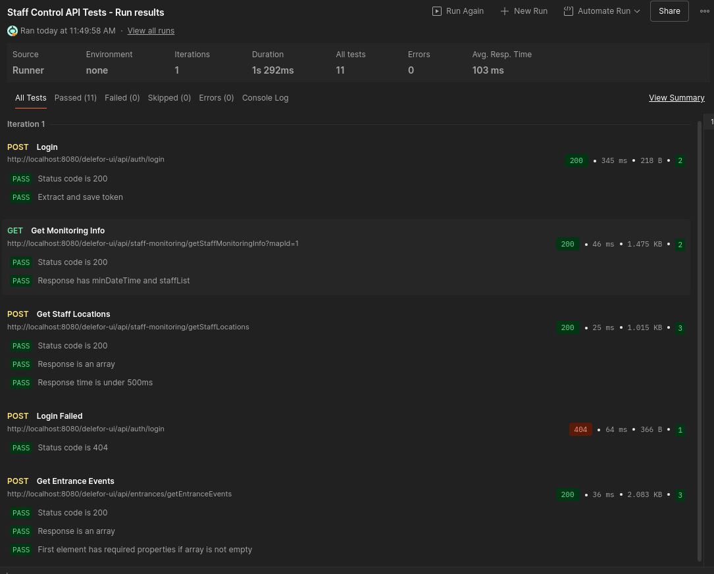

# Лабораторная работа 4: Проектирование API

В этом документе я фиксирую основные решения, которые мы приняли при проектировании REST API для системы Staff Control. 

Ниже перечислены 8 ключевых принципов, на которых мы остановились.

## 1. Stateless аутентификация (JWT)

Мы отказались от классических сессий на сервере (`HttpSession`) в пользу токенов JWT.

*   **Как это работает:** При логине сервер генерирует токен и отдает его клиенту. Клиент сохраняет его и прикрепляет к заголовку `Authorization` каждого запроса.
*   **Почему:** Серверу не нужно хранить состояние пользователя в памяти (Stateless). Это упрощает масштабирование и избавляет от проблем с "протухшими" сессиями при перезагрузке сервера. Плюс, это стандарт де-факто для SPA (Single Page Applications).

## 2. Строгое использование HTTP методов

Мы договорились не использовать `POST` для всего подряд. Браузеры и кэширующие прокси придумали не зря.

*   `GET`: Только чтение. Идемпотентный метод.
*   `POST`: Создание новых ресурсов или отправка сложных форм фильтрации.
*   `PUT`: Полное обновление ресурса.
*   `DELETE`: Удаление.

## 3. Версионирование через URL

Закладываем возможность версионирования в путь, хотя пока работаем в рамках первой версии.

*   **Пример:** `/api/v1/...`
*   **Мысли вслух:** Это страховка на будущее. Если мы решим кардинально поменять структуру данных, мы сможем выпустить `v2`, не ломая работу старых клиентов.

## 4. Идентификаторы: UUID вместо Integer

Для ID сущностей (сотрудников, отчетов) мы используем UUID.

*   **Почему это важно:** Последовательные ID (`1, 2, 3...`) — это дыра в безопасности. Злоумышленник может просто перебирать цифры в URL и скачивать базу сотрудников. UUID (`550e8400-e29b-41d4-a716-446655440000`) не переберешь.
*   **Минусы:** Их невозможно запомнить и диктовать коллеге по телефону. Но безопасность перевешивает неудобство.

## 5. Даты и время только в UTC (ISO 8601)

Время — это вечная боль любого разработчика. Особенно когда сервер в одном часовом поясе, база данных в другом, а пользователь — в третьем.

*   **Решение:** API всегда принимает и отдает время в формате `YYYY-MM-DDTHH:mm:ssZ` (Zulu time, UTC).
*   **Как это работает:** Никаких локальных таймзон на сервере. Сервер не должен гадать, откуда пришел запрос. Задача фронтенда — взять это UTC время и показать пользователю в его локальном времени. Это снимает кучу головной боли при отладке.

## 6. Единый формат ошибок

Возвращать просто 500-й код с пустым телом или стандартный Tomcat-овский HTML (который невозможно распарсить кодом) — дурной тон.

Если что-то пошло не так, API возвращает JSON с понятной структурой:

```json
{
    "errorCode": "DLFR-01000",
    "errorMessageEn": "DLFR-01000: Invalid username or password",
    "errorMessageRu": "DLFR-01000: Неверное имя пользователя или пароль"
}
```

Это позволяет однозначно идентифицировать проблему по коду `DLFR-XXXX`, а не парсить текст сообщения.

## 7. Пагинация для списков по умолчанию

У нас есть раздел мониторинга персонала. Если загрузить всех сотрудников и все их проходы за год одним запросом, браузер просто зависнет (а база данных ляжет).

*   **Решение:** Все методы, возвращающие списки, принимают параметры `page` (номер страницы) и `size` (размер страницы).
*   **Пример:** `GET /api/v1/monitoring?page=0&size=20`
*   Если параметры не переданы, используем разумные значения по умолчанию (например, первые 20 записей). Отдавать всю базу одним куском запрещено на уровне контроллера.

## 8. namingConvention: camelCase для JSON

В Java мы используем `camelCase`, в базе данных (SQL) обычно `snake_case`. Возникает вопрос: как отдавать поля в JSON?

*   **Решение:** Используем `camelCase` (например, `firstName`, `employeeStatus`).
*   **Почему:** Потребитель нашего API — Angular-приложение (JavaScript/TypeScript). Там стандартом является `camelCase`. Заставлять фронтендеров писать `employee_status` — это просто издевательство над их код-стайлом. Сериализатор (Jackson) сам сконвертирует имена полей.

---

## Реализованные методы API

Ниже — список того, что реально работает в коде. Честно говоря, местами мы отошли от идеального REST (да, каюсь, есть глаголы в URL), но это было сделано ради скорости разработки и удобства фронтенда. Работает — не трогай.

Все запросы идут с префиксом `/delefor-ui/api`.

### 1. Аутентификация (`/auth`)

Самый простой контроллер. Пока только логин, регистрацию админ делает через базу (или предполагается отдельная админка).

#### **`POST /login`**
Вход пользователя.

**Пример запроса:**
```json
{
  "username": "admin",
  "password": "superSecretPassword123"
}
```

**Ответ (200 OK):**
```json
{
  "token": "eyJhbGciOiJIUzI1NiJ9.eyJzdWIiOiJhZG1pbiIsImV4cCI6MTY5...",
  "user": {
    "username": "admin",
    "role": "ADMIN"
  }
}
```

**Пояснение полей:**
*   `token`: JWT токен доступа. Его нужно сохранить (например, в localStorage) и добавлять в заголовок `Authorization: Bearer ...` ко всем следующим запросам.
*   `user`: Объект с краткой информацией о пользователе (для отображения в шапке сайта).

### 2. Мониторинг персонала (`/staff-monitoring`)

Здесь самое интересное — получение данных для отрисовки карты в реальном времени.

#### **`GET /getStaffMonitoringInfo?mapId=1`**
Загружает справочную информацию для фильтров: список сотрудников и границы времени.

**Параметры:**
*   `mapId` (query param): ID карты, для которой запрашиваем данные.

**Ответ (200 OK):**
```json
{
  "minDateTime": "2023-01-01T00:00:00Z",
  "maxDateTime": "2023-10-27T15:30:00Z",
  "staffList": [
    { "id": 101, "fullName": "Иванов И.И." },
    { "id": 102, "fullName": "Петров П.П." }
  ]
}
```

**Пояснение полей:**
*   `minDateTime`, `maxDateTime`: Границы времени, за которое в системе есть исторические данные. Используются, чтобы ограничить выбор дат в календаре (datepicker) на фронтенде.
*   `staffList`: Список всех сотрудников, доступных для фильтрации на этой карте. Используется для заполнения выпадающего списка (multiselect).

#### **`POST /getStaffLocations`**
Получает текущие координаты точек (людей, станков, датчиков) с учетом фильтров.

**Пример запроса:**
```json
{
  "online": true,
  "currentTime": "2023-10-27T10:00:00Z",
  "employees": [
    { "value": 101 }, 
    { "value": 105 }
  ]
}
```
**Пояснение полей:**
*   `online` (boolean): Если `true`, показываем только тех, кто сейчас на смене/активен.
*   `currentTime` (Date): Метка времени, на которую мы хотим видеть состояние ("снимок" ситуации).
*   `employees` (Array): Список объектов сотрудников, которых нужно отобразить (фильтрация по персонам).

**Ответ (200 OK):**
```json
[
  {
    "id": 101,
    "x": 450.5,
    "y": 300.0,
    "type": "person",
    "name": "Иванов И.И.",
    "status": "working",
    "macAddress": "00:1B:44:11:3A:B7"
  },
  {
    "id": 55,
    "x": 100.0,
    "y": 100.0,
    "type": "machine",
    "name": "Станок ЧПУ-1",
    "status": "connected"
  }
]
```

**Пояснение полей:**
*   `x`, `y`: Координаты объекта на карте (относительно левого верхнего угла подложки).
*   `type`: Тип объекта (`person` — сотрудник, `machine` — станок, `sensor` — датчик). Определяет, какую иконку рисовать.
*   `status`: Состояние объекта (например, `working`, `connected`). Определяет цвет обводки или индикатора (зеленый/красный).
*   `macAddress`: Технический идентификатор метки (BLE-метки), привязанной к объекту.

### 3. Проходы и события (`/entrances`)

Журнал событий: кто, где и когда прошел.

#### **`POST /getEntranceEvents`**
Получить список событий входа/выхода с фильтрацией.

**Пример запроса:**
```json
{
  "startDate": "2023-10-26T00:00:00Z",
  "endDate": "2023-10-27T23:59:59Z",
  "selectedEntranceTypes": ["Вход", "Выход"],
  "selectedEntranceNumbers": [1, 3]
}
```
**Пояснение полей:**
*   `startDate`, `endDate`: Временной диапазон поиска. Если `null`, ищется за всё время (но лучше так не делать).
*   `selectedEntranceTypes`: Массив строк. Можно выбрать только "Вход", чтобы видеть, кто пришел, но не ушел.
*   `selectedEntranceNumbers`: Массив ID турникетов (проходных).

**Ответ (200 OK):**
```json
[
  {
    "fullName": "Сидоров С.С.",
    "time": "2023-10-27T08:01:15Z",
    "entranceNumber": 1,
    "type": "Вход"
  },
  {
    "fullName": "Сидоров С.С.",
    "time": "2023-10-27T17:05:00Z",
    "entranceNumber": 1,
    "type": "Выход"
  }
]
```

**Пояснение полей:**
*   `fullName`: Отображаемое имя сотрудника.
*   `time`: Точное время прохода в UTC. Фронтенд должен перевести его в локальное время пользователя.
*   `entranceNumber`: Номер входа.
*   `type`: Направление движения (`Вход` или `Выход`).

### 4. Управление картами (`/locations`)

CRUD для карт помещений.

#### **`GET /getLocations`**
Получает список всех карт.

**Ответ (200 OK):**
```json
{
  "1": "Главный цех",
  "2": "Склад материалов",
  "5": "Офис 2 этаж"
}
```
**Пояснение:**
Возвращает структуру `Map` (словарь), где:
*   **Ключ**: ID карты (число).
*   **Значение**: Название карты (строка).
Удобно для быстрого поиска названия по ID без перебора массива.

#### **`GET /getLocation?id=1`**
Скачивает файл подложки.

*   **Ответ:** Бинарный файл (`Blob`, `image/svg+xml`). В браузере это выглядит как скачивание картинки или отображение SVG.

#### **`POST /createLocation`**
Создает новую пустую карту.

**Параметры:**
*   `name` (query param): Название новой карты (например, `?name=Новый Цех`).

**Ответ (200 OK):**
`15` (ID созданной карты, просто число).

#### **`PATCH /editLocation?id=1`**
Загружает/обновляет фоновую картинку (SVG).

**Тело запроса:**
*   `multipart/form-data`. Поле `file` с бинарным содержимым картинки.

#### **`PATCH /editLocationName?id=1&name=...`**
Переименовывает карту.

*   **Параметры:** `id` и `name` передаются в query params. Тело запроса пустое.

---

### Типичные ошибки (Common Errors)

Все ошибки приходят с HTTP кодом (4xx/5xx) и телом JSON в формате `DLFR`.

**1. Ошибка авторизации (401 Unauthorized)**
При попытке входа с неверными данными.

```json
{
    "errorCode": "DLFR-01000",
    "errorMessageEn": "DLFR-01000: Invalid username or password",
    "errorMessageRu": "DLFR-01000: Неверное имя пользователя или пароль"
}
```

**2. Сущность не найдена (404 Not Found)**
Например, запросили карту по ID, которого нет в базе.

```json
{
    "errorCode": "DLFR-04004",
    "errorMessageEn": "DLFR-04004: Location not found",
    "errorMessageRu": "DLFR-04004: Локация не найдена"
}
```

**3. Ошибка валидации / Конфликт (400/409)**
Например, попытка создать карту с именем, которое уже занято, или передача некорректных данных.

```json
{
    "errorCode": "DLFR-02001",
    "errorMessageEn": "DLFR-02001: Entity with this name already exists",
    "errorMessageRu": "DLFR-02001: Сущность с таким именем уже существует"
}
```

---

## Тестирование
